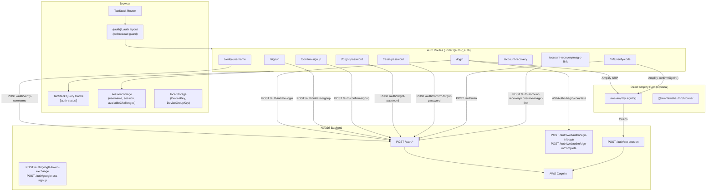
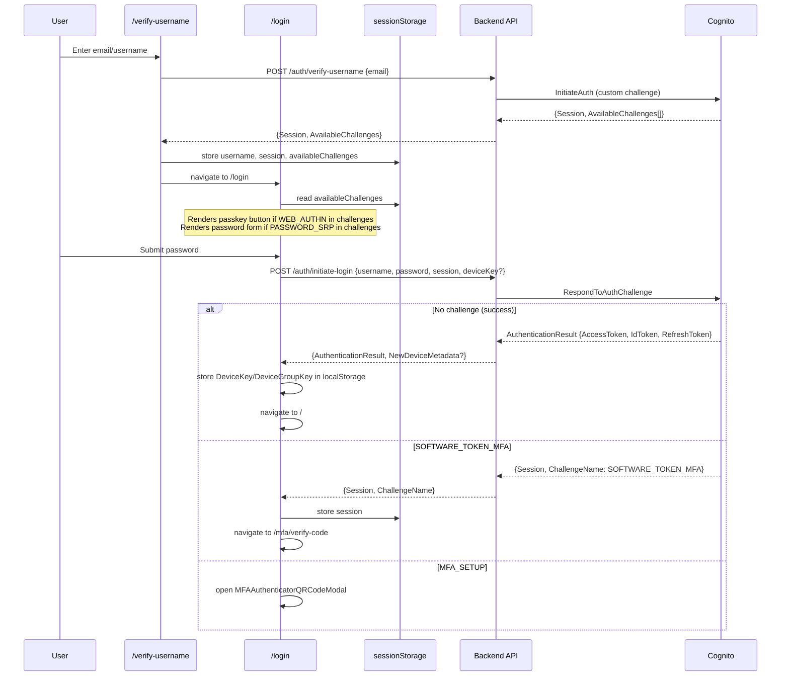
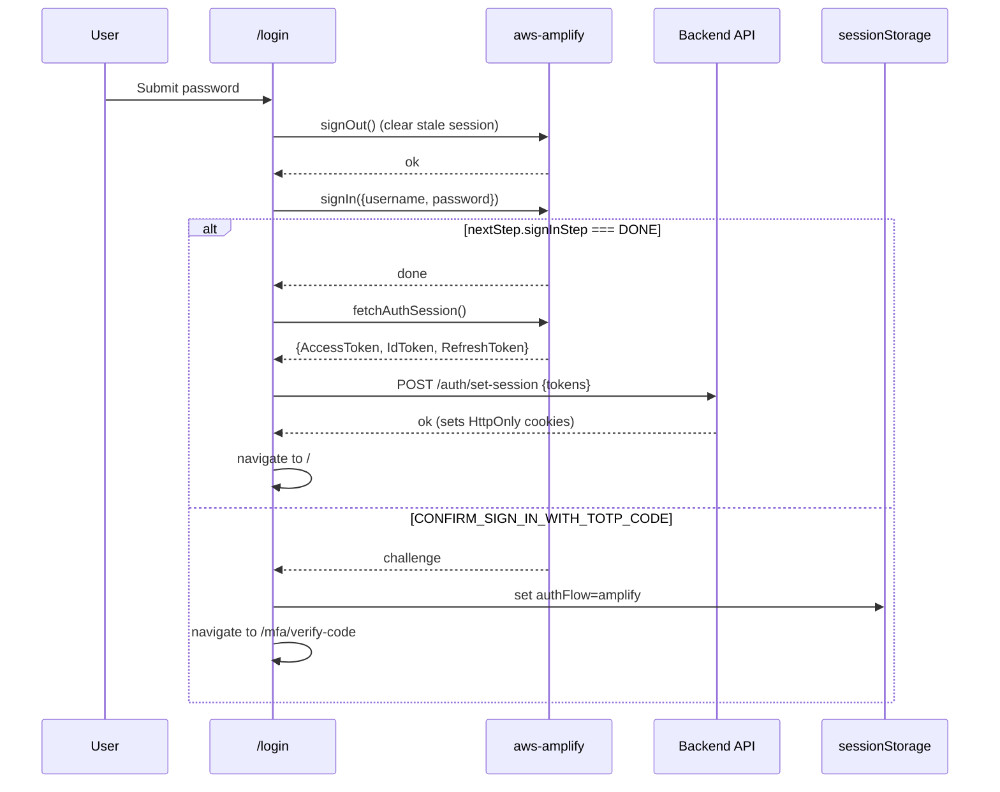
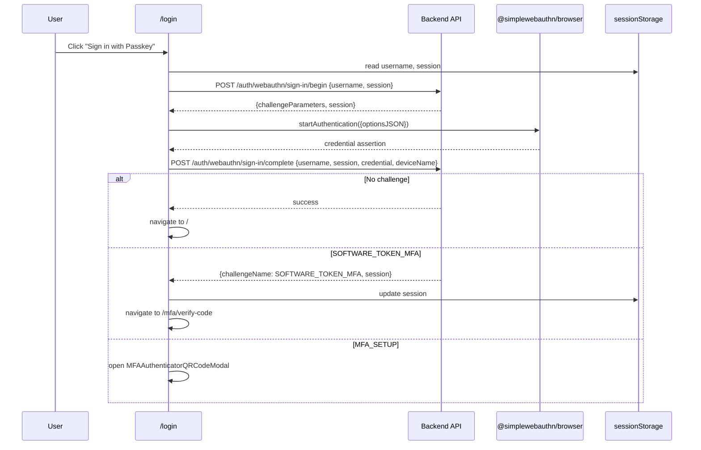
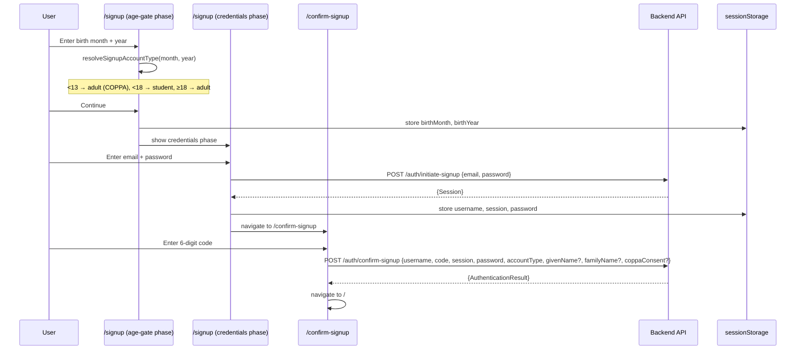
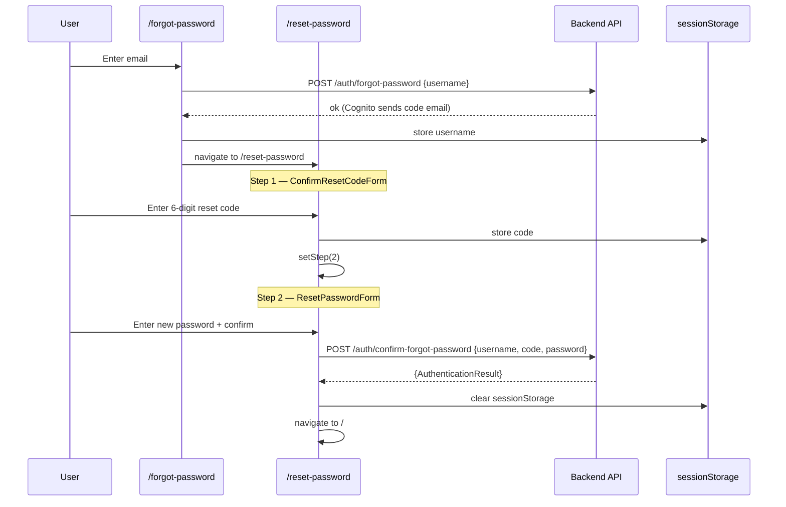
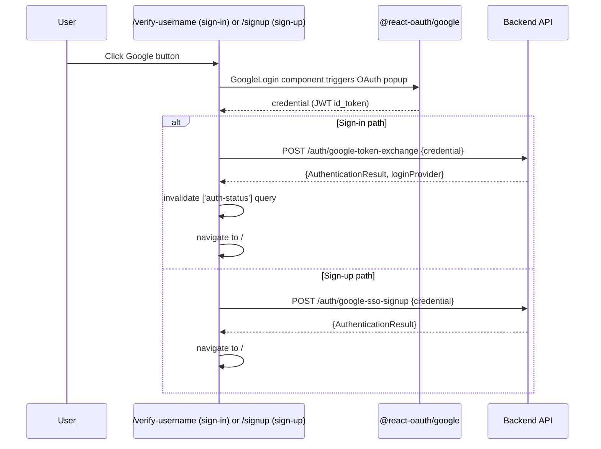
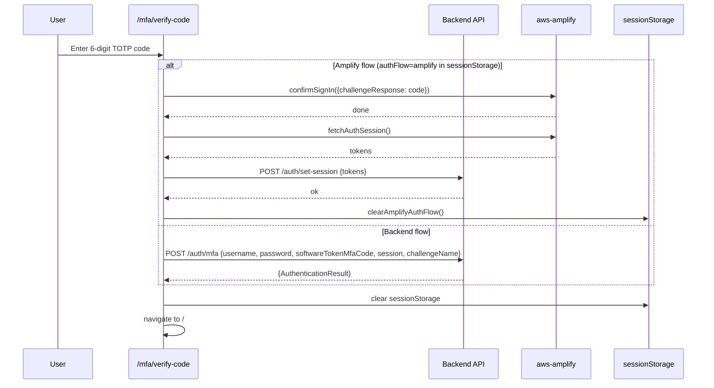
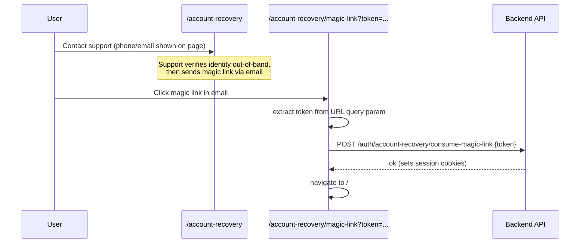

# Design Document: Authentication Flows

## Overview

The authentication-flows feature implements the complete set of identity and
access management flows for the application. It covers credential-based login
(password + MFA), passwordless login (passkeys/WebAuthn), social login (Google
OAuth), account creation with an age gate, email verification, password reset,
and account recovery via magic link. All flows are built on top of AWS Cognito
as the identity provider, with the React frontend communicating through a NestJS
backend that owns the HttpOnly session cookies.

The frontend is a React 19 + TanStack Router v1 SPA. Auth state is managed via
TanStack Query (`['auth-status']` query key). The auth layout route
`/(auth)/_auth` acts as a guard that redirects already-authenticated users away
from auth pages, with explicit carve-outs for the forgot-password and
reset-password routes which authenticated users may also need.

There are two login code paths: a **direct Amplify SRP path** (when
`VITE_COGNITO_USER_POOL_ID` and `VITE_COGNITO_CLIENT_ID` are set) where the
password never leaves the browser, and a **backend-proxied path** where
credentials are forwarded to the NestJS API. Both paths converge on the same
challenge-routing logic and ultimately call `POST /auth/set-session` to exchange
tokens for HttpOnly cookies.

---

## Architecture



---

## Sequence Diagrams

### Flow 1: Verify Username → Password Login



### Flow 2: Direct Amplify SRP Login (when env vars set)



### Flow 3: Passkey (WebAuthn) Login



### Flow 4: Signup with Age Gate



### Flow 5: Forgot Password → Reset Password



### Flow 6: Google SSO



### Flow 7: MFA Verification



### Flow 8: Account Recovery Magic Link



---

## Components and Interfaces

### Auth Layout Guard: `/(auth)/_auth`

**Purpose**: Wraps all auth routes. Redirects authenticated users to `/` unless
they are on `/forgot-password` or `/reset-password` (with a username in
sessionStorage).

**Key logic** (`beforeLoad`):

```typescript
const isAuthenticated = await authContext.checkAuth();
const allowedForAuthenticated =
  isForgotPasswordRoute || (isResetPasswordRoute && hasUsernameInSession);
if (isAuthenticated && !allowedForAuthenticated) {
  throw redirect({ to: '/' });
}
```

**Renders**: Sticky header with Sign in / Sign up links, and an `<Outlet />` for
child routes.

---

### `useAuth` hook

**Purpose**: Provides auth state to the app. Calls `UserServices.getUser()` to
determine if the session cookie is valid.

```typescript
interface UseAuthReturn {
  isLoading: boolean;
  isAuthenticated: boolean;
  checkAuth: () => Promise<boolean>;
}
```

- Query key: `['auth-status']`
- `retry: false`, `refetchOnWindowFocus: false`
- `checkAuth()` calls `refetch()` and returns the boolean result — used by the
  router `beforeLoad` guard.

---

### `useVerifyUsername` hook

**Purpose**: Calls `POST /auth/verify-username` to look up a Cognito user and
retrieve available auth challenges.

```typescript
// Input
type VerifyUsernameRequest = { email: string; session?: string };

// Output
type VerifyUsernameResponse = {
  message: string;
  data: { Session: string; AvailableChallenges: string[] };
};
```

On success, the form stores `session`, `availableChallenges`, and `username` in
`sessionStorage` then navigates to `/login`.

---

### `useLoginMutation` hook

**Purpose**: Handles password login. Branches on whether direct Cognito
(Amplify) is configured.

```typescript
type LoginMutationVariables = {
  username: string;
  password: string;
  session?: string;
  deviceKey?: string;
  deviceName?: string;
};
```

- If `isCognitoAuthConfigured()` → calls `signInWithCognito()` (Amplify SRP),
  then `AuthServices.setSession(tokens)`.
- Otherwise → calls `AuthServices.initiateAuth()` (backend-proxied).

Challenge routing after success:

- `SOFTWARE_TOKEN_MFA` → navigate to `/mfa/verify-code`
- `NEW_PASSWORD_REQUIRED` → navigate to `/reset-password`
- `MFA_SETUP` → open `MFAAuthenticatorQRCodeModal`
- No challenge + `AuthenticationResult` → store device keys, navigate to `/`

Error handling: `UserNotConfirmedException` → resend code, navigate to
`/confirm-signup`.

---

### `usePasskeyLogin` hook

**Purpose**: Orchestrates the two-step WebAuthn sign-in (begin → complete).

```typescript
type UsePasskeyLoginOptions = { onMfaSetupRequired?: () => void };
```

Reads `username` and `session` from `sessionStorage`. Calls
`webAuthnSignInBegin`, then `startAuthentication` from
`@simplewebauthn/browser`, then `webAuthnSignInComplete`. Routes based on
`challengeName` in the response.

---

### `useCompleteMFAAuth` hook

**Purpose**: Completes a TOTP MFA challenge. Branches on Amplify vs backend
flow.

```typescript
type CompleteMFAMutationVariables = {
  username: string;
  password: string;
  softwareTokenMfaCode: string;
  session: string;
  challengeName: string;
};
```

- If `isAmplifyAuthFlow()` → calls `confirmSignInAndGetTokens(code)`, then
  `AuthServices.setSession(tokens)`, then `clearAmplifyAuthFlow()`.
- Otherwise → calls `AuthServices.completeMFAAuth(variables)`.

---

### `useGoogleSignin` / `useGoogleSignup` hooks

**Sign-in**: Calls `POST /auth/google-token-exchange`. On success, stores
`lastLoginProvider` in sessionStorage, invalidates `['auth-status']` query,
navigates to `/`.

**Sign-up**: Calls `POST /auth/google-sso-signup`. On success, navigates to `/`.

---

### `SignupFlow` component

**Purpose**: Multi-phase signup UI. Manages the age-gate → credentials
transition.

```typescript
type Phase = 'age-gate' | 'credentials';

function resolveSignupAccountType(
  month: number | '',
  year: number | '',
): SignupAccountType;
// Returns 'adult' for <13 (COPPA path) or ≥18, 'student' for 13–17
```

Stores `birthMonth` and `birthYear` in sessionStorage on continue.

---

## Data Models

### sessionStorage keys (auth flows)

| Key                       | Set by                                           | Consumed by                                                    | Purpose                                         |
| ------------------------- | ------------------------------------------------ | -------------------------------------------------------------- | ----------------------------------------------- |
| `username`                | verify-username form, login form                 | login form, MFA form, confirm-signup form, reset-password form | Current user identifier                         |
| `session`                 | verify-username form, login form, confirm-signup | login form, passkey hook, MFA form                             | Cognito session token for challenge flows       |
| `availableChallenges`     | verify-username form                             | login route                                                    | Comma-separated list of Cognito challenge names |
| `password`                | signup flow                                      | confirm-signup form                                            | Temporary password for auto-login after confirm |
| `code`                    | confirm-reset-code form                          | reset-password form                                            | Reset code for confirm-forgot-password          |
| `authFlow`                | `setAmplifyAuthFlow()`                           | `isAmplifyAuthFlow()`                                          | Marks that Amplify SDK owns the current sign-in |
| `lastLoginProvider`       | Google sign-in success                           | new-device modal                                               | Tracks last login method                        |
| `birthMonth`, `birthYear` | signup age-gate                                  | signup credentials phase                                       | Age gate inputs                                 |

### localStorage keys

| Key                    | Purpose                                       |
| ---------------------- | --------------------------------------------- |
| `DeviceKey`            | Cognito device tracking key                   |
| `DeviceGroupKey`       | Cognito device group key                      |
| `DeviceRandomPassword` | Cognito device random password                |
| `AddedDeviceKey`       | Previously confirmed device key sent on login |

### Password validation schema (`signup-password-schema.ts`)

```typescript
const signupPasswordFieldSchema = z
  .string()
  .min(8)
  .regex(/[A-Z]/) // uppercase
  .regex(/[a-z]/) // lowercase
  .regex(/[0-9]/) // digit
  .regex(/[!@#$%^&*]/); // special character
```

### Age gate logic (`signup-age.ts`)

```typescript
function ageFromBirthMonthYear(month1to12: number, year: number): number;
// Uses last day of birth month to bias toward requiring under-13 path

function isUnder13(month: number, year: number): boolean;
function isUnder18(month: number, year: number): boolean;
```

Account type resolution:

- `month === '' || year === ''` → `'student'` (default)
- `isUnder13` → `'adult'` (COPPA consent required)
- `isUnder18` → `'student'`
- otherwise → `'adult'`

---

## Key Functions with Formal Specifications

### `signInWithCognito(username, password)`

**Location**: `src/lib/cognito-auth.ts`

**Preconditions**:

- `VITE_COGNITO_USER_POOL_ID` and `VITE_COGNITO_CLIENT_ID` are set
- `username` is a non-empty string
- `password` is a non-empty string

**Postconditions**:

- Returns `{ success: true, tokens }` when Cognito returns `DONE`
- Returns `{ success: false, challenge: true, challengeName, signInStep }` when
  a challenge is required
- Returns `{ success: false, error }` on any exception
- Always calls `signOut()` first to clear stale Amplify session state
- When `success: true`, `tokens` contains at least `AccessToken` and `IdToken`
- Sets `authFlow = 'amplify'` in sessionStorage when a challenge is returned

**Loop invariants**: N/A (no loops)

---

### `resolveSignupAccountType(month, year)`

**Location**: `src/components/forms/signup-flow.tsx`

**Preconditions**:

- `month` is a number 1–12 or `''`
- `year` is a 4-digit year number or `''`

**Postconditions**:

- Returns `'student'` when either input is `''`
- Returns `'adult'` when `isUnder13(month, year)` is true (COPPA path)
- Returns `'student'` when `isUnder18(month, year)` is true
- Returns `'adult'` when age ≥ 18
- Never throws

---

### `ageFromBirthMonthYear(month1to12, year)`

**Location**: `src/lib/signup-age.ts`

**Preconditions**:

- `month1to12` is a finite number
- `year` is a finite number

**Postconditions**:

- Returns `NaN` if inputs are non-finite or month is outside 1–12
- Uses the last day of the birth month (conservative bias toward younger age)
- Returns a non-negative integer representing completed years of age

**Loop invariants**: N/A

---

### `loginMutationFn(variables)`

**Location**: `src/hooks/use-login-mutation.ts`

**Preconditions**:

- `variables.username` is non-empty
- `variables.password` is non-empty

**Postconditions**:

- If `isCognitoAuthConfigured()`: uses Amplify SRP path, calls `setSession` on
  success
- Otherwise: calls `AuthServices.initiateAuth` (backend-proxied)
- Returns `LoginMutationData` with `ChallengeName` indicating next step
- On success with no challenge: `AuthenticationResult` is present
- Throws on auth failure (propagated to mutation error state)

---

## Error Handling

### Unconfirmed user attempts login

**Condition**: Cognito returns `UserNotConfirmedException` during `initiateAuth`
**Response**: `LoginForm.onError` catches this, calls
`resendSignupConfirmationCode`, stores `username` in sessionStorage, navigates
to `/confirm-signup` **Recovery**: User completes email verification

### Missing session on /login

**Condition**: `availableChallenges` is empty in sessionStorage when `/login`
mounts **Response**: `router.navigate({ to: '/verify-username' })` is called
immediately **Recovery**: User re-enters their username

### Missing username on /reset-password

**Condition**: `sessionStorage.getItem('username')` is null when
`/reset-password` mounts **Response**: `<Navigate to="/forgot-password" />` is
rendered **Recovery**: User re-enters their email to request a new reset code

### Missing token on /account-recovery/magic-link

**Condition**: `token` query param is absent from the URL **Response**: Renders
"Invalid recovery link" card with a link back to `/account-recovery`
**Recovery**: User contacts support again

### Passkey missing session

**Condition**: `username` or `session` is empty in sessionStorage when passkey
login is triggered **Response**: Throws
`Error('Missing sign-in session. Go back and verify your email again.')`
**Recovery**: User navigates back to `/verify-username`

### Amplify stale session conflict

**Condition**: Amplify has a cached signed-in user when `signInWithCognito` is
called **Response**: `signOut()` is called first (errors silently swallowed),
then `signIn()` proceeds **Recovery**: Transparent to user

---

## Testing Strategy

### Unit Testing Approach

Test pure utility functions in isolation:

- `ageFromBirthMonthYear` — boundary values (exactly 13, exactly 18, leap years,
  invalid inputs)
- `resolveSignupAccountType` — all four branches (empty, under-13, 13–17, 18+)
- `signupPasswordFieldSchema` — valid and invalid password strings
- `mapSignInStepToChallengeName` — all mapped challenge names and unknown values

### Property-Based Testing Approach

**Property Test Library**: fast-check

Key properties:

- For any valid `(month, year)` pair, `resolveSignupAccountType` always returns
  `'adult'` or `'student'`
- For any `month` outside 1–12 or non-finite inputs, `ageFromBirthMonthYear`
  returns `NaN`
- For any birth date where `isUnder13` is true, `resolveSignupAccountType`
  returns `'adult'`
- For any birth date where `isUnder18` is true and `isUnder13` is false,
  `resolveSignupAccountType` returns `'student'`

### Integration Testing Approach

Cypress component/E2E tests exist for the signup flow (`signup-flow.cy.tsx`).
Key integration scenarios:

- Verify username → login → MFA challenge routing
- Signup age gate → credentials → confirm-signup → redirect to home
- Forgot password → reset password two-step form
- Google SSO sign-in and sign-up paths
- Auth guard: unauthenticated access to private routes redirects to
  `/verify-username`
- Auth guard: authenticated user visiting `/login` redirects to `/`
- Auth guard: authenticated user can access `/forgot-password`

---

## Security Considerations

- **HttpOnly cookies**: Tokens are never stored in JavaScript-accessible
  storage. The backend sets `HttpOnly` cookies via `POST /auth/set-session`. The
  frontend never reads raw JWT values.
- **SRP in browser**: When Amplify is configured, the password is used only for
  the SRP handshake in the browser and never sent to the backend.
- **sessionStorage for transient state**: Challenge session tokens, username,
  and password (for auto-login after signup) are stored in `sessionStorage`
  (tab-scoped, cleared on tab close). They are cleared after use (e.g.,
  `sessionStorage.clear()` after MFA success).
- **COPPA age gate**: Users under 13 are routed through the COPPA consent path.
  The age calculation biases toward the younger age (uses last day of birth
  month) to avoid incorrectly classifying a child as an adult.
- **Cypress guard on Google SSO**:
  `{!window.Cypress && <GoogleSSOSigninButton />}` prevents the Google OAuth
  button from rendering in Cypress test environments.
- **Device tracking**: Cognito device keys are stored in `localStorage` and sent
  on subsequent logins to enable device-remembered MFA flows.

---

## Dependencies

| Package                     | Purpose                                                 |
| --------------------------- | ------------------------------------------------------- |
| `@tanstack/react-router` v1 | File-based routing, `beforeLoad` auth guard             |
| `@tanstack/react-query` v5  | Auth state cache (`['auth-status']`), mutation hooks    |
| `@tanstack/react-form`      | Form state management with Zod validators               |
| `aws-amplify`               | Direct SRP sign-in, `confirmSignIn`, `fetchAuthSession` |
| `@react-oauth/google`       | Google OAuth `GoogleLogin` component                    |
| `@simplewebauthn/browser`   | WebAuthn `startAuthentication` for passkey login        |
| `zod`                       | Password schema validation, form field schemas          |
| `ua-parser-js`              | Device name detection for passkey and device tracking   |

---

## Correctness Properties

_A property is a characteristic or behavior that should hold true across all
valid executions of a system — essentially, a formal statement about what the
system should do. Properties serve as the bridge between human-readable
specifications and machine-verifiable correctness guarantees._

### Property 1: resolveSignupAccountType always returns a valid account type

_For any_ combination of month (number 1–12 or `''`) and year (number or `''`),
`resolveSignupAccountType` SHALL return either `'adult'` or `'student'` and
SHALL never throw.

**Validates: Requirements 7.7, 7.8, 7.9, 7.10**

---

### Property 2: Under-13 inputs always resolve to 'adult' (COPPA path)

_For any_ valid (month, year) pair where `isUnder13(month, year)` returns true,
`resolveSignupAccountType(month, year)` SHALL return `'adult'`.

**Validates: Requirements 7.8**

---

### Property 3: 13–17 inputs always resolve to 'student'

_For any_ valid (month, year) pair where `isUnder18(month, year)` is true and
`isUnder13(month, year)` is false, `resolveSignupAccountType(month, year)` SHALL
return `'student'`.

**Validates: Requirements 7.9**

---

### Property 4: Invalid inputs to ageFromBirthMonthYear return NaN

_For any_ `month1to12` value outside the range 1–12, or any non-finite
`month1to12` or `year`, `ageFromBirthMonthYear` SHALL return `NaN`.

**Validates: Requirements 15.1, 15.2**

---

### Property 5: Valid inputs to ageFromBirthMonthYear return a non-negative integer

_For any_ valid month (1–12) and year representing a past date,
`ageFromBirthMonthYear` SHALL return a non-negative integer (completed years of
age).

**Validates: Requirements 15.4**

---

### Property 6: signupPasswordFieldSchema accepts exactly the strings satisfying all five rules

_For any_ string, `signupPasswordFieldSchema.safeParse(s).success` SHALL be true
if and only if the string has length ≥ 8, contains at least one uppercase letter
(A–Z), at least one lowercase letter (a–z), at least one digit (0–9), and at
least one special character from `!@#$%^&*`.

**Validates: Requirements 14.1, 14.2, 14.3, 14.4, 14.5, 14.6**

---

### Property 7: Auth guard redirects authenticated users away from all non-exempt auth routes

_For any_ auth route path that is not `/forgot-password` and is not
`/reset-password` with a username in sessionStorage, an authenticated user
navigating to that path SHALL be redirected to `/` by the Auth_Guard.

**Validates: Requirements 11.1, 11.4**

---

### Property 8: Private guard redirects unauthenticated users away from all private routes

_For any_ private route path, an unauthenticated user navigating to that path
SHALL be redirected to `/verify-username` with the original path as the
`redirect` search parameter.

**Validates: Requirements 12.1**
