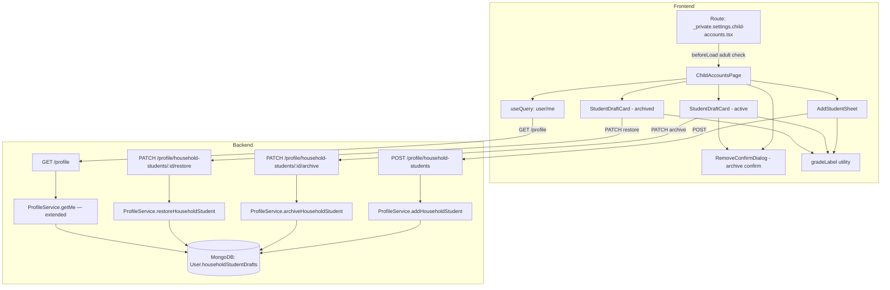

# Design Document: Child Accounts Settings

## Overview

This feature adds a **Child Accounts** settings page at
`/settings/child-accounts` where adult users can view, add, archive, and restore
their household student drafts. The page integrates into the existing settings
shell layout and sidebar.

The core data model change is adding an `archivedAt` field to each entry in the
`householdStudentDrafts` array on the `User` document. Archiving is a
soft-delete: the record is retained and can be restored at any time. The
existing `GET /profile` `householdStudents` field continues to return only
active students (those with `archivedAt` null or absent), so the sidebar student
selector requires no changes. The settings page receives a separate field
(`householdStudentDraftsAll`) that includes all drafts — active and archived —
so the page can render both sections.

### Key Design Decisions

1. **`archivedAt` soft-delete on the subdocument** — no records are ever removed
   from the array; `archivedAt` is set to a UTC timestamp on archive and cleared
   to `null` on restore. This preserves all historical data.
2. **Two separate fields in `GET /profile`** — `householdStudents` (active only,
   existing field, no breaking change) and `householdStudentDraftsAll` (all
   drafts including archived, new field used only by the settings page). The
   sidebar continues to read `householdStudents` unchanged.
3. **Adult-only access enforced in `beforeLoad`** — mirrors the pattern used by
   `_private.settings.teaching-subjects.tsx`; non-adults are redirected to
   `/settings/profile` before the component mounts.
4. **Invalidate `['user', 'me']` on every mutation** — all three mutation hooks
   (add, archive, restore) invalidate the canonical profile cache key on
   success, keeping both the settings page and the sidebar student selector in
   sync.
5. **Reuse `RemoveConfirmDialog`** — the archive confirmation dialog reuses the
   existing `RemoveConfirmDialog` component with appropriate copy. No new dialog
   component is needed.
6. **`gradeLabel` utility** — a pure function `gradeLabel(n: number): string`
   maps 0 → "Kindergarten", 1–12 → "Grade N", 13 → "Grade 13 / Post-Secondary".
   It is used in both the display cards and the grade selector in the add form.
7. **`Adult_User` definition** — route `beforeLoad`, Profile_API mutations, and
   this document use `accountType === 'adult'` together with
   `ageBandAtRegistration === 'ADULT_18_PLUS'` (aligned with
   `_private.settings.teaching-subjects.tsx`).

---

## Requirements traceability

| Requirement | Primary design coverage |
| ----------- | ----------------------- |
| 1 | Route file, `head` meta, settings sidebar nav |
| 2 | `ChildAccountsPage`, `householdStudentDraftsAll`, `StudentDraftCard`, loading/error/empty states |
| 3 | `AddStudentSheet`, `POST /profile/household-students`, mutation hook + query invalidation |
| 4 | Archive button, `RemoveConfirmDialog`, `PATCH .../archive`, `archivingId` state |
| 5 | Restore button, `PATCH .../restore`, no confirmation |
| 6 | `getMe` filtering for `householdStudents`; `student-context.tsx` unchanged |
| 7 | `ProfileController` handlers, DTO, service methods |
| 8 | MongoDB subdocument `archivedAt`, `getMe` mappings for both profile fields |
| 9 | `gradeLabel`, `GRADE_OPTIONS`, grade display on cards and in add form |

---

## Non-goals

- In-place editing of an existing student draft’s fields on this page (display,
  add, archive, restore only).
- Hard-delete or permanent removal of student drafts from the array.
- Changing how minors or non-adult accounts authenticate or select students.

---

## Architecture



---

## Components and Interfaces

### Frontend Components

#### Route file: `_private.settings.child-accounts.tsx`

```typescript
export const Route = createFileRoute(
  '/(private)/_private/settings/child-accounts',
)({
  beforeLoad: async () => {
    try {
      const response = await UserServices.getUser();
      const { accountType, ageBandAtRegistration } = response.data;
      if (
        accountType !== 'adult' ||
        ageBandAtRegistration !== 'ADULT_18_PLUS'
      ) {
        throw redirect({ to: '/settings/profile' });
      }
    } catch (err) {
      if (isRedirect(err)) throw err;
      // Other fetch errors: let the page component handle them
    }
  },
  head: () => ({
    meta: [{ title: 'Child Accounts | Settings' }],
  }),
  component: ChildAccountsPage,
});
```

#### `ChildAccountsPage`

Top-level page component. Responsibilities:

- Calls `useQuery(['user', 'me'])` to get profile data including
  `householdStudentDraftsAll`.
- Splits drafts into `active` (archivedAt null/absent) and `archived`
  (archivedAt non-null) arrays for rendering.
- Renders loading skeleton, error state with retry, empty state (active section
  only), or the student lists.
- Renders an "Add Student" button that opens `AddStudentSheet`.
- Manages `archivingId` state (which student is being archived) and opens
  `RemoveConfirmDialog` for confirmation.
- Hides the archived section entirely when there are no archived drafts.

#### `StudentDraftCard`

Displays a single student draft. Props:

```typescript
type StudentDraftCardProps = {
  draft: HouseholdStudentDraftAll;
  onArchive?: (studentDraftId: string) => void;
  onRestore?: (studentDraftId: string) => void;
  isArchiving?: boolean;
  isRestoring?: boolean;
};
```

Renders: `displayName`, `gradeLabel(currentGrade)`, `lastPromotionYear`. Active
cards show an "Archive" button (disabled when `isArchiving`). Archived cards
show a "Restore" button (disabled when `isRestoring`).

#### `AddStudentSheet`

A slide-over sheet (using the existing `Sheet` UI primitive) containing the
add-student form. Props:

```typescript
type AddStudentSheetProps = {
  open: boolean;
  onOpenChange: (open: boolean) => void;
};
```

Form fields:

- `displayName`: text input, required, max 100 characters
- `currentGrade`: select dropdown using `gradeLabel` labels (values 0–13)

Submit button disabled while mutation is pending or form is invalid. On success
the sheet closes and the profile query is invalidated. On error an inline error
message is shown and the sheet stays open.

### Settings Sidebar Update

`settings-shell-sidebar.tsx` — add to `settingsNav`:

```typescript
import { Users } from 'lucide-react';

{ to: '/settings/child-accounts', label: 'Child Accounts', icon: Users },
```

### Frontend API Service Extensions

Add to `user.services.ts`:

```typescript
// Extended type with archivedAt
export type HouseholdStudentDraftAll = {
  studentDraftId: string;
  displayName: string;
  currentGrade: number;
  lastPromotionYear: number;
  archivedAt?: string | null;
};

// Add to ProfileUserData
householdStudentDraftsAll?: HouseholdStudentDraftAll[];

// New service methods
addHouseholdStudent: async (json: {
  displayName: string;
  currentGrade: number;
}): Promise<{
  message: string;
  data: { householdStudentDrafts: HouseholdStudentDraftAll[] };
}> => {
  const response = await api.post('profile/household-students', { json });
  return response.json();
},

archiveHouseholdStudent: async (
  studentDraftId: string,
): Promise<{
  message: string;
  data: { householdStudentDrafts: HouseholdStudentDraftAll[] };
}> => {
  const response = await api.patch(
    `profile/household-students/${encodeURIComponent(studentDraftId)}/archive`,
    { json: {} },
  );
  return response.json();
},

restoreHouseholdStudent: async (
  studentDraftId: string,
): Promise<{
  message: string;
  data: { householdStudentDrafts: HouseholdStudentDraftAll[] };
}> => {
  const response = await api.patch(
    `profile/household-students/${encodeURIComponent(studentDraftId)}/restore`,
    { json: {} },
  );
  return response.json();
},
```

### Backend Endpoints

#### `POST /profile/household-students`

- Guard: `AuthGuard` (existing) + inline adult check in service
- Body DTO: `AddHouseholdStudentDto` (see Data Models)
- Action: generates UUID v4 `studentDraftId`, sets `lastPromotionYear` to
  current calendar year, sets `archivedAt: null`, appends via
  `$push: { householdStudentDrafts: newDraft }`
- Response:
  `{ message, data: { householdStudentDrafts: HouseholdStudentDraftAll[] } }`

#### `PATCH /profile/household-students/:studentDraftId/archive`

- Guard: `AuthGuard` (existing) + inline adult check in service
- Param: `studentDraftId` (string)
- Action: finds draft by `studentDraftId`; throws 404 if not found; sets
  `archivedAt` to current UTC timestamp via `$set` on the matched array element
- Response:
  `{ message, data: { householdStudentDrafts: HouseholdStudentDraftAll[] } }`

#### `PATCH /profile/household-students/:studentDraftId/restore`

- Guard: `AuthGuard` (existing) + inline adult check in service
- Param: `studentDraftId` (string)
- Action: finds draft by `studentDraftId`; throws 404 if not found; clears
  `archivedAt` to `null` via `$set` on the matched array element
- Response:
  `{ message, data: { householdStudentDrafts: HouseholdStudentDraftAll[] } }`

---

## Data Models

### Frontend Types

```typescript
// Extended HouseholdStudentProfile with archivedAt (for householdStudents field)
export type HouseholdStudentProfile = {
  studentDraftId: string;
  displayName: string;
  currentGrade: number;
  lastPromotionYear: number;
  archivedAt?: string | null;
};

// Full draft type including archivedAt (for householdStudentDraftsAll field)
export type HouseholdStudentDraftAll = {
  studentDraftId: string;
  displayName: string;
  currentGrade: number;
  lastPromotionYear: number;
  archivedAt?: string | null;
};

// ProfileUserData additions
export type ProfileUserData = {
  // ... existing fields ...
  householdStudents?: HouseholdStudentProfile[]; // active only (existing)
  householdStudentDraftsAll?: HouseholdStudentDraftAll[]; // all drafts (new)
};
```

### Backend Schema Change

```typescript
// In user.schema.ts — householdStudentDrafts array entry gains archivedAt
householdStudentDrafts?: {
  studentDraftId: string;
  displayName: string;
  currentGrade: number;
  lastPromotionYear: number;
  archivedAt?: Date | null;  // NEW FIELD
}[];
```

### Backend Type Changes

```typescript
// HouseholdStudentMe gains archivedAt
export type HouseholdStudentMe = {
  studentDraftId: string;
  displayName: string;
  currentGrade: number;
  lastPromotionYear: number;
  archivedAt?: string | null; // NEW FIELD
};

// GetMeData gains householdStudentDraftsAll
export interface GetMeData {
  // ... existing fields ...
  householdStudents?: HouseholdStudentMe[]; // active only (existing)
  householdStudentDraftsAll?: HouseholdStudentMe[]; // all drafts (new)
}
```

### Backend DTO

```typescript
// nest-app/src/profile/dto/add-household-student.dto.ts
export class AddHouseholdStudentDto {
  @IsString()
  @MinLength(1)
  @MaxLength(100)
  displayName!: string;

  @Type(() => Number)
  @IsInt()
  @Min(0)
  @Max(13)
  currentGrade!: number;
}
```

### `getMe` Changes

The `getMe` method is updated to:

1. Filter `householdStudents` to only include entries where `archivedAt` is null
   or absent (was previously unfiltered since `archivedAt` didn't exist).
2. Add `householdStudentDraftsAll` that maps all drafts including `archivedAt`.

```
householdStudents = drafts
  .filter(d => !d.archivedAt)
  .map(d => ({ studentDraftId, displayName, currentGrade, lastPromotionYear, archivedAt: null }))

householdStudentDraftsAll = drafts
  .map(d => ({ studentDraftId, displayName, currentGrade, lastPromotionYear,
               archivedAt: d.archivedAt ? d.archivedAt.toISOString() : null }))
```

### `gradeLabel` Utility

```typescript
// tanstack-router/src/lib/grade-label.ts
export function gradeLabel(grade: number): string {
  if (grade === 0) return 'Kindergarten';
  if (grade >= 1 && grade <= 12) return `Grade ${grade}`;
  if (grade === 13) return 'Grade 13 / Post-Secondary';
  return String(grade);
}
```

---

## Correctness Properties

### Property 1: Student list renders all drafts

_For any_ non-empty array of `HouseholdStudentDraftAll` objects returned by the
profile API, the `ChildAccountsPage` SHALL render exactly one card per draft,
with no drafts omitted or duplicated across the active and archived sections.

**Validates: Requirements 2.1**

---

### Property 2: Active/archived split is correct

_For any_ array of `HouseholdStudentDraftAll` objects, the `ChildAccountsPage`
SHALL place each draft with `archivedAt` null or absent in the active section
and each draft with a non-null `archivedAt` in the archived section, with no
draft appearing in both sections.

**Validates: Requirements 2.2**

---

### Property 3: `gradeLabel` round-trip

_For all_ integers N in [0, 13], `gradeLabel(N)` SHALL return a non-empty
string, and the grade selector in `AddStudentSheet` SHALL map that label back to
N before submission (round-trip property).

**Validates: Requirement 9.3**

---

### Property 4: Add-student form rejects invalid submissions

_For any_ combination of form state where `displayName` is empty, exceeds 100
characters, or `currentGrade` is absent, the add-student form SHALL NOT enable
the submit button and SHALL display at least one field-level validation error.

**Validates: Requirements 3.5**

---

### Property 5: POST endpoint rejects invalid payloads

_For any_ payload that violates `AddHouseholdStudentDto` constraints (missing
`displayName`, `displayName` exceeding 100 characters, or `currentGrade` outside
0–13), `POST /profile/household-students` SHALL return HTTP 400.

**Validates: Requirement 7.2**

---

### Property 6: POST endpoint appends draft (round-trip)

_For any_ valid `AddHouseholdStudentDto` payload, the updated
`householdStudentDrafts` array returned in the response SHALL contain the new
draft as its last element with `archivedAt: null`, and a subsequent
`GET /profile` SHALL include that draft in `householdStudentDraftsAll`.

**Validates: Requirements 3.4, 7.1**

---

### Property 7: Archive sets `archivedAt`; restore clears it

_For any_ active Student_Draft, after a successful archive request the draft's
`archivedAt` SHALL be a non-null ISO timestamp. After a subsequent restore
request the draft's `archivedAt` SHALL be null. The draft SHALL remain in the
`householdStudentDrafts` array throughout (no removal).

**Validates: Requirements 4.4, 5.3**

---

### Property 8: `householdStudents` contains only active drafts

_For any_ user with a mix of active and archived drafts, the `householdStudents`
field in `GET /profile` SHALL contain only drafts where `archivedAt` is null or
absent, and SHALL NOT contain any archived draft.

**Validates: Requirements 6.1, 8.4**

---

## Error Handling

| Scenario                          | Frontend behavior                                | Backend behavior                               |
| --------------------------------- | ------------------------------------------------ | ---------------------------------------------- |
| Profile fetch fails               | Error banner with retry; student list not shown  | N/A                                            |
| POST fails (validation)           | Inline error in add sheet; sheet stays open      | HTTP 400 with field errors                     |
| POST fails (server error)         | Generic error in sheet; sheet stays open         | HTTP 500                                       |
| Archive fails                     | Error message; student stays in active section   | HTTP 400 or 500                                |
| Restore fails                     | Error message; student stays in archived section | HTTP 400 or 500                                |
| `studentDraftId` not found        | N/A (id derived from rendered list)              | HTTP 404                                       |
| Non-adult accesses route          | Redirect to `/settings/profile` before render    | HTTP 403 from mutation endpoints               |
| Concurrent archive (double-click) | Archive button disabled while request in-flight  | Idempotent: second request sets same timestamp |

---

## Testing Strategy

### Workspace compliance (Storybook / Cypress)

When implementing `AddStudentSheet` (form) and `StudentDraftCard` (UI), add or
update **Storybook** stories and **Cypress component** tests per project
convention. Use **`add-course-sheet.stories.tsx`** and
**`add-course-sheet.cy.tsx`** as the reference for layout, providers, and
interaction patterns. Tag new property-based tests with
`// Feature: child-accounts-settings, Property N: ...` as already specified below.

### Unit Tests (example-based)

- `gradeLabel`: 0 → "Kindergarten"; 1–12 → "Grade N"; 13 → "Grade 13 /
  Post-Secondary".
- `StudentDraftCard`: renders displayName, grade label, lastPromotionYear;
  active card shows Archive button; archived card shows Restore button; buttons
  disabled when in-flight.
- `AddStudentSheet`: submit disabled when form is empty; submit disabled when
  displayName exceeds 100 chars; grade selector shows all 14 options with
  correct labels.
- `ChildAccountsPage`: shows loading skeleton; shows empty state when no active
  drafts; shows error with retry; renders active and archived sections; hides
  archived section when no archived drafts.
- Route `beforeLoad`: redirects non-adult to `/settings/profile`; allows adult
  through.
- `ProfileService.addHouseholdStudent`: adult check; appends draft with
  archivedAt null; generates UUID; sets lastPromotionYear.
- `ProfileService.archiveHouseholdStudent`: adult check; sets archivedAt; throws
  404 for unknown id.
- `ProfileService.restoreHouseholdStudent`: adult check; clears archivedAt;
  throws 404 for unknown id.
- `ProfileService.getMe` (extended): `householdStudents` excludes archived;
  `householdStudentDraftsAll` includes all.

### Property-Based Tests

**Library**: `fast-check` (frontend, Vitest); `@fast-check/jest` (backend,
Jest). Minimum **100 iterations** per property test.

Each property test is tagged:
`// Feature: child-accounts-settings, Property N: <property text>`

**Property 1** — Student list renders all drafts Generate:
`fc.array(arbitraryHouseholdStudentDraftAll(), { minLength: 1, maxLength: 20 })`
Assert: rendered output contains exactly `drafts.length` student cards.

**Property 2** — Active/archived split is correct Generate:
`fc.array(arbitraryHouseholdStudentDraftAll(), { minLength: 0, maxLength: 20 })`
Assert: active section count + archived section count = total drafts; no draft
in both sections.

**Property 3** — `gradeLabel` round-trip Generate:
`fc.integer({ min: 0, max: 13 })` Assert: `gradeLabel(n)` is non-empty; grade
selector maps label back to n.

**Property 4** — Add-student form rejects invalid submissions Generate: form
state with at least one invalid field (empty displayName, displayName > 100
chars, missing grade) Assert: submit button is disabled; at least one error
message is visible.

**Property 5** — POST rejects invalid payloads (backend unit test) Generate:
invalid `AddHouseholdStudentDto` variants Assert: service throws
`BadRequestException`.

**Property 6** — POST appends draft (backend unit test) Generate:
`arbitraryAddHouseholdStudentDto()` with valid fields Assert: returned array
length = original + 1; last element matches input; `archivedAt` is null.

**Property 7** — Archive/restore round-trip (backend unit test) Generate: user
with N active drafts; pick random draft index Assert: after archive,
`archivedAt` is non-null; after restore, `archivedAt` is null; array length
unchanged throughout.

**Property 8** — `householdStudents` contains only active drafts (backend unit
test) Generate: user with mix of active and archived drafts Assert: `getMe`
response `householdStudents` length equals count of drafts with `archivedAt`
null/absent.

---

## Dependencies

- `uuid` (already available in nest-app via NestJS ecosystem) — for generating
  `studentDraftId` UUID v4
- `fast-check` (already installed in tanstack-router) — property-based testing
- `@fast-check/jest` (already installed in nest-app) — property-based testing
- `lucide-react` `Users` icon — for sidebar nav entry
- Existing UI primitives: `Sheet`, `Dialog`, `Select`, `Button`, `Card`,
  `Skeleton` — all available in `@/components/ui/`
- Existing `RemoveConfirmDialog` — reused for archive confirmation
