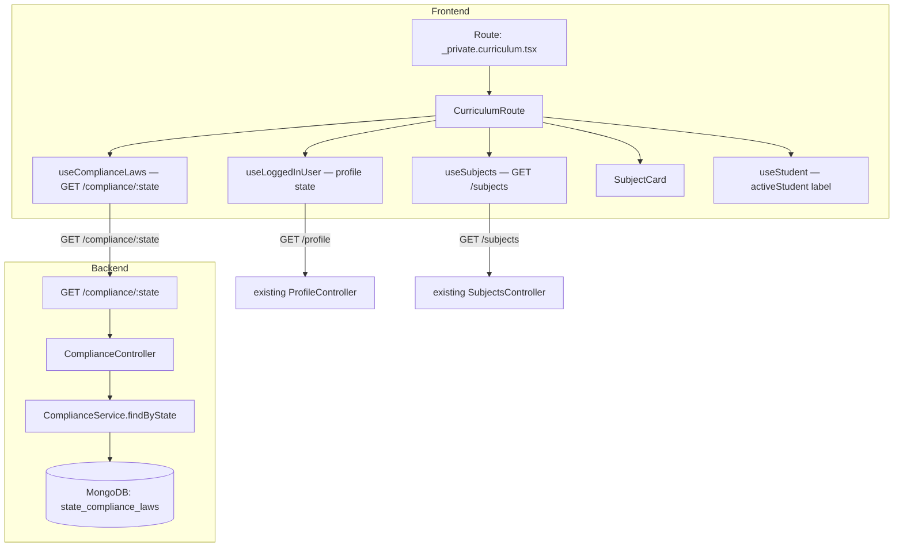

# Design Document: Curriculum Page

## Overview

This feature implements a read-only **Curriculum** page at `/curriculum` that
shows the subjects required by the adult user's state compliance laws. The page
fetches three data sources in parallel (profile, compliance laws, subjects
catalog), cross-references `subjectsRequiredTopicIds` against the catalog, and
renders a grid of subject cards. The active student from the sidebar is
acknowledged with a contextual label but does not affect which subjects are
shown.

On the backend, a new `GET /compliance/:state` endpoint is added to the existing
`ComplianceModule` by introducing a `ComplianceController` and
`ComplianceService`.

### Key Design Decisions

1. **State comes from the adult user's profile, not the student** — required
   subjects are a state-level legal requirement, not per-student. The active
   student is displayed for context only.
2. **Three parallel queries** — profile, compliance laws, and subjects are
   fetched concurrently with React Query. The compliance query is dependent on
   the profile's `state` field (enabled only when `state` is known), but
   subjects and profile can be fetched in parallel.
3. **Client-side join** — matching `subjectsRequiredTopicIds` to the subjects
   catalog is done in the component, not on the backend. This avoids a new
   aggregation endpoint and reuses the existing `GET /subjects` response.
4. **Authenticated endpoint** — `GET /compliance/:state` is protected by the
   existing `AuthGuard` to keep compliance data behind authentication.
5. **Case-insensitive state lookup** — the `:state` param is normalized to
   uppercase before the MongoDB query to handle variations in client input.
6. **No caching TTL customization** — all three queries use React Query's
   default stale time. Compliance laws change infrequently; the default is
   acceptable for MVP.

---

## Architecture



The frontend is a standard React Query page. The backend adds a controller and
service to the existing `ComplianceModule` without touching any other module.

---

## Components and Interfaces

### Frontend Components

#### Route file: `_private.curriculum.tsx` (update existing)

```typescript
export const Route = createFileRoute('/(private)/_private/curriculum')({
  head: () => ({
    meta: [{ title: 'Curriculum | Cody Lillywhite' }],
  }),
  component: CurriculumRoute,
});
```

The existing placeholder component is replaced with the full `CurriculumRoute`
implementation. Unauthenticated users are already handled by the parent
`_private.tsx` route guard.

#### `CurriculumRoute` (page component)

Top-level page component. Responsibilities:

- Calls `useLoggedInUser()` (query key `['user', 'me']`) to get the user's
  `state` field from their profile.
- Calls `useComplianceLaws(state)` (query key `['compliance', state]`) — enabled
  only when `state` is a non-null string.
- Calls `useSubjects()` (query key `['subjects']`) to get the full catalog.
- Reads `activeStudent` from `useStudent()` for the contextual label.
- Derives `requiredSubjects` by filtering the subjects catalog to those whose
  `_id` appears in `complianceLaws.subjectsRequiredTopicIds`.
- Renders loading, error, missing-state, empty, or populated states.
- Renders a read-only grid of `SubjectCard` components — no add/remove/edit
  controls.

#### `SubjectCard`

Displays a single required subject. Props:

```typescript
type SubjectCardProps = {
  subject: Subject; // { _id, name, icon, color, slug, isEnrichment }
};
```

Renders: subject `icon` (as an image or icon element), subject `name`, and
applies subject `color` as a visual accent (background tint or border). No
interactive controls.

### Frontend API Service

#### New file: `tanstack-router/src/api/services/compliance.services.ts`

```typescript
import { api } from '../api.config';

export type ComplianceLaws = {
  state: string;
  abbreviation: string;
  subjectsRequiredTopicIds: string[];
  // other fields present but not needed for this feature
};

const ComplianceServices = {
  getComplianceLaws: async (state: string): Promise<ComplianceLaws> => {
    const response = await api.get(`compliance/${encodeURIComponent(state)}`);
    return response.json();
  },
};

export default ComplianceServices;
```

Uses the authenticated `api` client (HttpOnly cookie auth) because
`GET /compliance/:state` requires authentication.

### Frontend Query Hooks

#### New file: `tanstack-router/src/hooks/use-compliance-laws.ts`

```typescript
import { useQuery } from '@tanstack/react-query';
import ComplianceServices from '@/api/services/compliance.services';

const useComplianceLaws = (state: string | null | undefined) => {
  return useQuery({
    queryKey: ['compliance', state],
    queryFn: () => ComplianceServices.getComplianceLaws(state!),
    enabled: !!state,
  });
};

export default useComplianceLaws;
```

#### Existing hook: `useSubjects` (already exists via `SubjectsServices`)

The subjects catalog is already fetched via `SubjectsServices.getSubjects()`. A
`useSubjects` hook will be created if it does not already exist, following the
same pattern as `useLoggedInUser`.

### Backend Components

#### `ComplianceService`

New file: `nest-app/src/compliance/compliance.service.ts`

```typescript
@Injectable()
export class ComplianceService {
  constructor(
    @InjectModel(StateComplianceLaws.name)
    private readonly complianceLawsModel: Model<StateComplianceLaws>,
  ) {}

  async findByState(state: string): Promise<StateComplianceLaws> {
    const doc = await this.complianceLawsModel
      .findOne({ abbreviation: state.toUpperCase() })
      .exec();
    if (!doc) {
      throw new NotFoundException(
        `No compliance laws found for state: ${state}`,
      );
    }
    return doc;
  }
}
```

Looks up by `abbreviation` (e.g., `"CA"`, `"TX"`) rather than the full state
name, since the profile stores the abbreviation.

#### `ComplianceController`

New file: `nest-app/src/compliance/compliance.controller.ts`

```typescript
@Controller('compliance')
@UseGuards(AuthGuard)
export class ComplianceController {
  constructor(private readonly complianceService: ComplianceService) {}

  @Get(':state')
  async getComplianceLaws(@Param('state') state: string) {
    return this.complianceService.findByState(state);
  }
}
```

#### `ComplianceModule` update

Add `ComplianceController` and `ComplianceService` to the existing module:

```typescript
@Module({
  imports: [
    MongooseModule.forFeature([
      { name: StateComplianceLaws.name, schema: StateComplianceLawsSchema },
    ]),
  ],
  controllers: [ComplianceController],
  providers: [ComplianceService],
  exports: [MongooseModule],
})
export class ComplianceModule {}
```

---

## Data Models

### Frontend Types

```typescript
// tanstack-router/src/api/services/compliance.services.ts
export type ComplianceLaws = {
  _id: string;
  state: string;
  abbreviation: string;
  subjectsRequiredTopicIds: string[]; // ObjectId strings
  // remaining fields omitted — not needed for this feature
};
```

The `Subject` type already exists in
`tanstack-router/src/api/services/subjects.services.ts`:

```typescript
export type Subject = {
  _id: string;
  name: string;
  icon: string;
  color: string;
  slug: string;
  isEnrichment: boolean;
};
```

### Client-Side Join Logic

```typescript
const requiredSubjects: Subject[] = subjects.filter((subject) =>
  complianceLaws.subjectsRequiredTopicIds.includes(subject._id),
);
```

This is a simple `Array.filter` + `Array.includes` join. No backend aggregation
is needed.

---

## Correctness Properties

### Property 1: Required subjects list matches subjectsRequiredTopicIds

_For any_ `subjectsRequiredTopicIds` array and any subjects catalog, the
`requiredSubjects` derived list SHALL contain exactly the subjects whose `_id`
appears in `subjectsRequiredTopicIds`, with no omissions and no subjects whose
`_id` is absent from `subjectsRequiredTopicIds`.

**Validates: Requirements 5.1, 5.4**

---

### Property 2: Subject card displays name, icon, and color

_For any_ `Subject` object, the rendered `SubjectCard` SHALL include the
subject's `name`, `icon`, and `color` values in the output.

**Validates: Requirement 5.2**

---

### Property 3: No interactive controls rendered for any subject list

_For any_ non-empty array of `Subject` objects rendered on the
`CurriculumRoute`, the rendered output SHALL contain zero add, remove, or edit
controls.

**Validates: Requirement 5.5**

---

### Property 4: Required subjects are invariant under active student change

_For any_ fixed `subjectsRequiredTopicIds` and subjects catalog, the
`requiredSubjects` list SHALL be identical regardless of which
`HouseholdStudentProfile` (or null) is set as the active student.

**Validates: Requirement 6.4**

---

## Error Handling

| Scenario                         | Frontend behavior                                          | Backend behavior                  |
| -------------------------------- | ---------------------------------------------------------- | --------------------------------- |
| Profile fetch fails              | Error banner with retry; subject list not shown            | N/A                               |
| Profile `state` is null/absent   | Prompt to complete profile; compliance query not triggered | N/A                               |
| Compliance fetch fails           | Error banner with retry; subject list not shown            | N/A                               |
| Unknown state abbreviation       | Error banner (404 from API); subject list not shown        | HTTP 404 with descriptive message |
| Subjects fetch fails             | Error banner with retry; subject list not shown            | N/A                               |
| `subjectsRequiredTopicIds` empty | Empty-state message; no subject cards rendered             | N/A                               |
| ID in list has no catalog match  | Entry silently omitted; remaining subjects shown           | N/A                               |
| Unauthenticated request          | Redirected to login by parent `_private.tsx` guard         | HTTP 401 from `AuthGuard`         |

---

## Testing Strategy

### Unit Tests (example-based)

- `SubjectCard`: renders name, icon, and color; no interactive controls present.
- `CurriculumRoute`: shows loading indicator while any query is loading; shows
  error banner with retry when profile fetch fails; shows error banner when
  compliance fetch fails; shows error banner when subjects fetch fails; shows
  empty state when `subjectsRequiredTopicIds` is empty; renders one card per
  required subject; shows active student label when student is selected; shows
  no label when no student is selected.
- `useComplianceLaws`: query is disabled when state is null; query is enabled
  when state is a non-empty string.
- `ComplianceService.findByState`: returns document when abbreviation matches;
  throws `NotFoundException` when no document found; lookup is case-insensitive.
- `ComplianceController`: returns 200 with document on match; returns 404 on no
  match; returns 401 when unauthenticated.

### Property-Based Tests

**Library**: `fast-check` (already installed) with Vitest for the frontend; Jest
for the backend. Minimum **100 iterations** per property test.

Each property test is tagged with a comment:
`// Feature: curriculum-page, Property N: <property text>`

**Property 1** — Required subjects list matches subjectsRequiredTopicIds
Generate: `fc.array(fc.string(), { maxLength: 20 })` as
`subjectsRequiredTopicIds` and `fc.array(arbitrarySubject(), { maxLength: 30 })`
as the catalog. Assert: `requiredSubjects.length` equals the count of catalog
subjects whose `_id` is in `subjectsRequiredTopicIds`; every element in
`requiredSubjects` has its `_id` in `subjectsRequiredTopicIds`.

**Property 2** — Subject card displays name, icon, and color Generate:
`arbitrarySubject()` with random `name`, `icon`, and `color` strings. Assert:
rendered `SubjectCard` output contains the subject's `name`, `icon`, and `color`
values.

**Property 3** — No interactive controls for any subject list Generate:
`fc.array(arbitrarySubject(), { minLength: 0, maxLength: 20 })`. Assert:
rendered `CurriculumRoute` (with mocked queries) contains zero buttons or links
labelled "Add", "Remove", or "Edit".

**Property 4** — Required subjects invariant under active student change
Generate: fixed `subjectsRequiredTopicIds` + catalog + two different
`HouseholdStudentProfile` values (or null). Assert: `requiredSubjects` computed
with student A equals `requiredSubjects` computed with student B.
