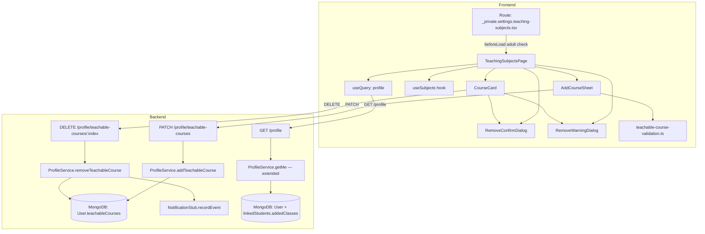

# Design Document: Manage Teachable Subjects

## Overview

This feature adds a **Teaching Subjects** settings page at
`/settings/teaching-subjects` where adult users can view, add, and remove the
courses they offer to students. The page integrates into the existing settings
shell layout and sidebar, reuses the validation utilities already present in
`teachable-course-validation.ts`, and introduces two new backend endpoints for
appending and removing individual courses without replacing the entire user
document.

Because enrolled students may reference a teachable course by index, in-place
editing is intentionally excluded. The removal flow has two branches: a simple
confirmation dialog when no students are enrolled, and a warning dialog when
active enrollments exist that explains parents will be notified.

### Key Design Decisions

1. **Adult-only access enforced in `beforeLoad`** — the route's `beforeLoad`
   hook reads the profile query cache (or fetches it) and redirects non-adults
   to `/settings/profile` before the component mounts.
2. **`activeEnrollmentCount` piggybacked on `GET /profile`** — rather than a
   separate enrollment-status endpoint, the backend computes enrollment counts
   per course when building the profile response, keeping the frontend to a
   single data fetch.
3. **Append-only mutation** — `PATCH /profile/teachable-courses` appends one
   course; `DELETE /profile/teachable-courses/:index` removes by zero-based
   index. This avoids race conditions from full-array replacement.
4. **Notification stub** — no notification service exists yet; the backend
   records notification events in a `notificationEvents` array on the user
   document (or a stub service) so the contract is established and can be wired
   to a real delivery mechanism later.
5. **Refetch-on-success** — after a successful mutation the frontend invalidates
   the `['profile']` React Query key, triggering a refetch rather than doing
   optimistic updates. This keeps the displayed `activeEnrollmentCount` values
   accurate.

---

## Architecture



The frontend is a standard React Query + TanStack Router page. The backend
extends the existing `ProfileController` and `ProfileService` with two new
endpoints and augments `getMe` to compute enrollment counts.

---

## Components and Interfaces

### Frontend Components

#### Route file: `_private.settings.teaching-subjects.tsx`

```typescript
export const Route = createFileRoute(
  '/(private)/_private/settings/teaching-subjects',
)({
  beforeLoad: async ({ context }) => {
    // Read profile from React Query cache or fetch it.
    // If accountType !== 'adult' || ageBandAtRegistration !== 'adult_18_plus',
    // throw redirect({ to: '/settings/profile' })
  },
  head: () => ({
    meta: [{ title: 'Teaching Subjects | Settings' }],
  }),
  component: TeachingSubjectsPage,
});
```

The `beforeLoad` hook accesses the TanStack Router context (which exposes the
React Query `queryClient`) to read or fetch the cached profile. If the user is
not an adult, it throws a redirect to `/settings/profile`. Unauthenticated users
are already handled by the parent `_private.tsx` route guard.

#### `TeachingSubjectsPage`

Top-level page component. Responsibilities:

- Calls `useQuery(['profile'])` to get profile data including `teachableCourses`
  with `activeEnrollmentCount`.
- Calls `useSubjects()` to get the subject catalog for name resolution.
- Renders loading skeleton, error state with retry, empty state, or the course
  list.
- Renders the "Add Subject" button that opens `AddCourseSheet`.
- Renders the contextual note about remove-and-re-add.

#### `CourseCard`

Displays a single teachable course. Props:

```typescript
type CourseCardProps = {
  course: TeachableCourseWithEnrollment; // see Data Models
  index: number;
  subjects: Subject[];
  onRemove: (index: number) => void;
  isRemoving: boolean;
};
```

Renders: subject name (resolved from `subjects`), `className`, grade display
(`matchesAllGrades ? 'All grades' : grades.join(', ')`), curriculum label,
`maxStudents`. Shows a "Remove" button that calls `onRemove(index)`. The Remove
button is disabled when `isRemoving` is true.

No edit control is rendered.

#### `AddCourseSheet`

A slide-over sheet (using the existing `Sheet` UI primitive) containing the
add-course form. Props:

```typescript
type AddCourseSheetProps = {
  open: boolean;
  onOpenChange: (open: boolean) => void;
  subjects: Subject[];
};
```

The form fields mirror `TeachableCourseOnboardingDto`:

- Subject selector (dropdown from `subjects`)
- Class name (text input)
- Grade selector (multi-select, options filtered by
  `homeschoolGradeOptionsWithinSpanLimit`)
- Curriculum selector (enum dropdown)
- Max students (number input, 1–20)

Validation uses `rowIsComplete`, `gradesSelectionIsValid`,
`rowGradeSpanViolationMessage`, and `reconcileGradesAfterMultiSelect` from
`teachable-course-validation.ts`. The submit button is disabled while the
mutation is pending. On success the sheet closes and the profile query is
invalidated. On error an inline error message is shown.

#### `RemoveConfirmDialog`

Standard confirmation dialog for courses with `activeEnrollmentCount === 0`.
Props:

```typescript
type RemoveConfirmDialogProps = {
  open: boolean;
  onConfirm: () => void;
  onCancel: () => void;
  isPending: boolean;
};
```

#### `RemoveWarningDialog`

Warning dialog for courses with `activeEnrollmentCount > 0`. Props:

```typescript
type RemoveWarningDialogProps = {
  open: boolean;
  enrollmentCount: number;
  onConfirm: () => void;
  onCancel: () => void;
  isPending: boolean;
};
```

Displays the enrollment count and explains that parents will be notified.

### Settings Sidebar Update

`settings-shell-sidebar.tsx` — add to `settingsNav`:

```typescript
import { BookOpen } from 'lucide-react';

{ to: '/settings/teaching-subjects', label: 'Teaching Subjects', icon: BookOpen },
```

### Frontend API Service Extensions

Add to `user.services.ts`:

```typescript
addTeachableCourse: async (json: {
  className: string;
  subjectId: string;
  matchesAllGrades: boolean;
  grades: string[];
  curriculum: string;
  maxStudents: number;
}): Promise<{ message: string; data: { teachableCourses: TeachableCourseWithEnrollment[] } }> => {
  const response = await api.patch('profile/teachable-courses', { json });
  return response.json();
},

removeTeachableCourse: async (
  index: number,
): Promise<{ message: string; data: { teachableCourses: TeachableCourseWithEnrollment[] } }> => {
  const response = await api.delete(`profile/teachable-courses/${index}`);
  return response.json();
},
```

### Backend Endpoints

#### `PATCH /profile/teachable-courses`

- Guard: `AuthGuard` (existing) + inline adult check in service
- Body DTO: `AddTeachableCourseDto` (see Data Models)
- Action: `$push: { teachableCourses: newCourse }` via
  `UsersService.updateByCognitoSub`
- Response:
  `{ message, data: { teachableCourses: TeachableCourseResponseItem[] } }`

#### `DELETE /profile/teachable-courses/:index`

- Guard: `AuthGuard` (existing) + inline adult check in service
- Param: `index` (parsed as integer, validated ≥ 0 and < array length)
- Action: Uses MongoDB positional `$unset` + `$pull` pattern (or array splice +
  `$set`) to remove the element at the given index
- Side effect: If `activeEnrollmentCount > 0` for that course, records
  notification events
- Response:
  `{ message, data: { teachableCourses: TeachableCourseResponseItem[] } }`

---

## Data Models

### Frontend Types

```typescript
// Extends the existing TeachableCourse shape with enrollment data from GET /profile
export type TeachableCourseWithEnrollment = {
  className: string;
  subjectId: string;
  matchesAllGrades: boolean;
  grades: string[];
  curriculum: string;
  maxStudents: number;
  activeEnrollmentCount: number; // computed by backend
};

// ProfileUserData extended (user.services.ts)
export type ProfileUserData = {
  // ... existing fields ...
  teachableCourses?: TeachableCourseWithEnrollment[];
};
```

### Backend DTOs

#### `AddTeachableCourseDto`

```typescript
// nest-app/src/profile/dto/add-teachable-course.dto.ts
export class AddTeachableCourseDto {
  @IsString()
  @MinLength(1)
  @MaxLength(256)
  className!: string;

  @IsMongoId()
  subjectId!: string;

  @IsBoolean()
  matchesAllGrades!: boolean;

  @IsArray()
  @Validate(TeachableCourseGradesConstraint)
  grades!: HomeschoolGrade[];

  @IsEnum(HomeschoolCurriculum)
  curriculum!: HomeschoolCurriculum;

  @Type(() => Number)
  @IsInt()
  @Min(1)
  @Max(20)
  maxStudents!: number;
}
```

This reuses `TeachableCourseGradesConstraint` from `account-setup.dto.ts`.

#### `TeachableCourseResponseItem`

```typescript
// Returned in the data array for both mutation endpoints and GET /profile
export type TeachableCourseResponseItem = {
  className: string;
  subjectId: string;
  matchesAllGrades: boolean;
  grades: string[];
  curriculum: string;
  maxStudents: number;
  activeEnrollmentCount: number;
};
```

### Active Enrollment Count Computation

When building the `GET /profile` response for an adult user, the backend
computes `activeEnrollmentCount` for each course:

```
For each teachableCourse at index i:
  activeEnrollmentCount = count of linkedStudents whose addedClasses
    contains an entry where:
      entry.adult === user._id
      AND entry.course references teachableCourses[i]
```

Because `EnrolledClass.course` is an ObjectId ref to `TeachableCourse` (an
embedded document without its own `_id` by default — `_id: false` in the
schema), the reference strategy needs clarification. Two options:

**Option A (recommended):** Enable `_id: true` on `TeachableCourse` subdocuments
so each gets a stable ObjectId. `EnrolledClass.course` stores that ObjectId. The
count query becomes a straightforward `$in` lookup.

**Option B:** Match by array index stored on `EnrolledClass` (add a
`courseIndex` field). Less robust if courses are reordered.

The design adopts **Option A**. The `TeachableCourse` schema will be updated to
generate `_id` values (remove `_id: false`), and `EnrolledClass.course` will
reference that ObjectId.

### Notification Stub

No notification delivery service exists. The backend will record notification
intent in a `notificationEvents` array on the user document (or a lightweight
in-memory stub service) so the contract is established:

```typescript
// Stub: appended to user document or emitted to a stub service
type NotificationEvent = {
  type: 'COURSE_REMOVED';
  recipientUserId: string; // parent's user _id
  payload: {
    adultUserId: string;
    courseClassName: string;
    courseSubjectId: string;
  };
  createdAt: Date;
};
```

The design notes this as a placeholder; a real notification service (email,
push, in-app) can consume these events later.

---

## Correctness Properties

_A property is a characteristic or behavior that should hold true across all
valid executions of a system — essentially, a formal statement about what the
system should do. Properties serve as the bridge between human-readable
specifications and machine-verifiable correctness guarantees._

### Property 1: Course list renders all courses

_For any_ non-empty array of `TeachableCourseWithEnrollment` objects returned by
the profile API, the `TeachingSubjectsPage` SHALL render exactly one card or row
per course, with no courses omitted or duplicated.

**Validates: Requirements 2.1**

---

### Property 2: Course card displays all required fields

_For any_ `TeachableCourseWithEnrollment` and its resolved subject, the rendered
`CourseCard` SHALL include the subject name, `className`, grade display (either
the grade list or "All grades" when `matchesAllGrades` is true), curriculum
label, and `maxStudents` value.

**Validates: Requirements 2.3**

---

### Property 3: Add-course form rejects incomplete submissions

_For any_ combination of form state where at least one required field (subject,
class name, grades, curriculum, maxStudents) is missing or invalid, the
add-course form SHALL NOT enable the submit button and SHALL display at least
one field-level validation error.

**Validates: Requirements 3.3, 3.7**

---

### Property 4: Enrichment subjects allow "All grades"; non-enrichment subjects do not

_For any_ subject with `isEnrichment === true`, the grade selector SHALL include
the "All grades" option. _For any_ subject with `isEnrichment === false`, the
grade selector SHALL NOT include the "All grades" option and SHALL require at
least one specific grade.

**Validates: Requirements 3.4, 3.5**

---

### Property 5: Grade-span limit is enforced for non-enrichment subjects

_For any_ non-enrichment subject and any grade selection whose consecutive span
exceeds the limit defined by `getMaxConsecutiveGradesForSubject`, the add-course
form SHALL display a span-violation message and SHALL NOT enable the submit
button.

**Validates: Requirements 3.6**

---

### Property 6: Every course card has a Remove action and no Edit action

_For any_ list of `TeachableCourseWithEnrollment` objects rendered on the
`TeachingSubjectsPage`, each course SHALL have exactly one "Remove" action
control and SHALL have zero edit controls.

**Validates: Requirements 4.1, 6.1**

---

### Property 7: Warning dialog is shown for courses with active enrollments

_For any_ `TeachableCourseWithEnrollment` where `activeEnrollmentCount > 0`,
activating the "Remove" action SHALL open the `RemoveWarningDialog` (not the
simple confirmation dialog).

**Validates: Requirements 5.1, 8.3**

---

### Property 8: Warning dialog displays the correct enrollment count

_For any_ `TeachableCourseWithEnrollment` with `activeEnrollmentCount = N > 0`,
the `RemoveWarningDialog` SHALL display the value N as the count of affected
enrolled students.

**Validates: Requirements 5.3**

---

### Property 9: PATCH endpoint appends course (round-trip)

_For any_ valid `AddTeachableCourseDto` payload submitted to
`PATCH /profile/teachable-courses`, the updated `teachableCourses` array
returned in the response SHALL contain the new course as its last element, and a
subsequent `GET /profile` SHALL include that course.

**Validates: Requirements 7.1, 7.8**

---

### Property 10: PATCH endpoint rejects invalid payloads

_For any_ payload that violates the `AddTeachableCourseDto` constraints (missing
required fields, invalid enum values, grade-span violation, or `maxStudents`
outside 1–20), `PATCH /profile/teachable-courses` SHALL return HTTP 400.

**Validates: Requirements 7.2**

---

### Property 11: DELETE endpoint removes course at index (round-trip)

_For any_ adult user with N teachable courses and any valid zero-based index i
(0 ≤ i < N), `DELETE /profile/teachable-courses/:i` SHALL return the updated
array with N−1 courses, and the course that was at index i SHALL no longer be
present.

**Validates: Requirements 7.4, 7.8**

---

### Property 12: DELETE endpoint rejects invalid indices

_For any_ index value that is negative, non-integer, or greater than or equal to
the current array length, `DELETE /profile/teachable-courses/:index` SHALL
return HTTP 400.

**Validates: Requirements 7.5**

---

### Property 13: DELETE with active enrollments produces notification events

_For any_ teachable course with M active enrollments (M > 0), a successful
`DELETE /profile/teachable-courses/:index` SHALL produce exactly M notification
events, one per affected parent.

**Validates: Requirements 7.7**

---

### Property 14: GET /profile includes activeEnrollmentCount for every course

_For any_ adult user with N teachable courses, the `GET /profile` response SHALL
include an `activeEnrollmentCount` field for each of the N courses, with the
value accurately reflecting the number of linked students whose `addedClasses`
reference that course.

**Validates: Requirements 8.2**

---

## Error Handling

| Scenario                          | Frontend behavior                                                        | Backend behavior                                            |
| --------------------------------- | ------------------------------------------------------------------------ | ----------------------------------------------------------- |
| Profile fetch fails               | Error banner with retry button; course list not shown                    | N/A                                                         |
| Subjects fetch fails              | Subject names fall back to subject ID; form subject selector shows error | N/A                                                         |
| PATCH fails (validation)          | Inline error in add-course sheet; sheet stays open                       | HTTP 400 with field errors                                  |
| PATCH fails (server error)        | Generic error message in sheet                                           | HTTP 500                                                    |
| DELETE fails                      | Error toast; course remains in list                                      | HTTP 400 or 500                                             |
| Non-adult accesses route          | Redirect to `/settings/profile` before render                            | HTTP 403 from mutation endpoints                            |
| Index out of range                | N/A (index derived from rendered list position)                          | HTTP 400                                                    |
| Concurrent removal (double-click) | Remove button disabled while request is in-flight                        | Idempotent: second request returns 400 (index already gone) |

---

## Testing Strategy

### Unit Tests (example-based)

- `CourseCard`: renders all required fields; Remove button present; no edit
  button present; Remove button disabled when `isRemoving=true`.
- `AddCourseSheet`: submit disabled when form is empty; submit disabled when
  grade span is violated; enrichment subject shows "All grades" option;
  non-enrichment subject hides "All grades".
- `RemoveConfirmDialog`: renders and calls `onConfirm`/`onCancel` correctly.
- `RemoveWarningDialog`: displays enrollment count; renders notification warning
  text.
- `TeachingSubjectsPage`: shows loading skeleton; shows empty state; shows error
  with retry; shows course list.
- Route `beforeLoad`: redirects non-adult to `/settings/profile`; allows adult
  through.
- `ProfileService.addTeachableCourse`: adult check; appends course; returns
  updated array.
- `ProfileService.removeTeachableCourse`: adult check; removes at index; records
  notification events when enrollments exist.
- `ProfileService.getMe` (extended): includes `activeEnrollmentCount` per
  course.

### Property-Based Tests

Property-based testing is applicable here because the feature involves data
transformation logic (enrollment count computation, grade validation, course
array mutation) with large input spaces where edge cases matter.

**Library**: [fast-check](https://fast-check.dev/) for the frontend
(TypeScript/Vitest); [@fast-check/jest](https://github.com/dubzzz/fast-check) or
a custom fast-check integration for the backend (NestJS/Jest). Minimum **100
iterations** per property test.

Each property test is tagged with a comment in the format:
`// Feature: manage-teachable-subjects, Property N: <property text>`

**Property 1** — Course list renders all courses Generate:
`fc.array(arbitraryTeachableCourseWithEnrollment(), { minLength: 1, maxLength: 20 })`
Assert: rendered output contains exactly `courses.length` course cards.

**Property 2** — Course card displays all required fields Generate:
`arbitraryTeachableCourseWithEnrollment()`, `arbitrarySubject()` Assert:
rendered card string contains subject name, className, grade display,
curriculum, maxStudents.

**Property 3** — Add-course form rejects incomplete submissions Generate:
`fc.record({ ... })` with at least one required field set to an invalid/empty
value Assert: submit button is disabled; at least one error message is visible.

**Property 4** — Enrichment/non-enrichment grade options Generate:
`arbitrarySubject()` with `isEnrichment` as a boolean Assert: "All grades"
option presence matches `isEnrichment`.

**Property 5** — Grade-span limit enforced Generate: non-enrichment subject +
grade selection exceeding `getMaxConsecutiveGradesForSubject` Assert:
`rowGradeSpanViolationMessage` returns non-null; form submit is disabled.

**Property 6** — Every course has Remove, no Edit Generate:
`fc.array(arbitraryTeachableCourseWithEnrollment(), { minLength: 0, maxLength: 20 })`
Assert: Remove button count equals course count; edit button count equals 0.

**Property 7** — Warning dialog for enrolled courses Generate:
`arbitraryTeachableCourseWithEnrollment()` with `activeEnrollmentCount > 0`
Assert: clicking Remove opens `RemoveWarningDialog`, not `RemoveConfirmDialog`.

**Property 8** — Warning dialog shows correct count Generate:
`fc.integer({ min: 1, max: 100 })` as `activeEnrollmentCount` Assert: dialog
text contains the exact count value.

**Property 9** — PATCH appends course (backend unit test with mocked Mongoose)
Generate: `arbitraryAddTeachableCourseDto()` Assert: returned array length =
original length + 1; last element matches input.

**Property 10** — PATCH rejects invalid payloads (backend unit test) Generate:
invalid `AddTeachableCourseDto` variants (missing fields, bad enums, span
violations, maxStudents out of range) Assert: service throws
`BadRequestException`.

**Property 11** — DELETE removes at index (backend unit test with mocked
Mongoose) Generate: `fc.array(arbitraryTeachableCourse(), { minLength: 1 })` +
valid index Assert: returned array length = original − 1; course at original
index is absent.

**Property 12** — DELETE rejects invalid indices (backend unit test) Generate:
negative integers, non-integers, indices ≥ array length Assert: service throws
`BadRequestException`.

**Property 13** — DELETE produces correct notification event count (backend unit
test) Generate: `fc.integer({ min: 1, max: 20 })` as enrollment count Assert:
notification events array length equals enrollment count after DELETE.

**Property 14** — GET /profile includes activeEnrollmentCount per course
(backend unit test) Generate: adult user with random `teachableCourses` array
and random linked student enrollment data Assert: response
`teachableCourses[i].activeEnrollmentCount` equals the actual count of matching
`addedClasses` entries for each i.
